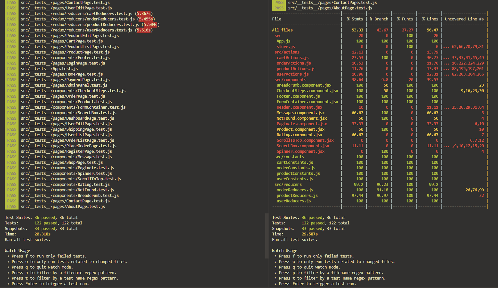

<p align="center">
    
</p>

## Introduction

This ecommerce application was build for a software engineering module. The documentation includes everything from installation process to deployment. You can also find and see how development went from A to Z in the `Development` tab.

<b>Documentation itself for this ecommerce app can be found [here](https://dziugaspeciulevicius.github.io/eds-store-docs/).</b>


---
## Env Variables

Create a .env file in the root directory and add the following:
```
NODE_ENV = development
PORT = 5000
MONGO_URI = your mongodb uri
JWT_SECRET = 'abc123'
PAYPAL_CLIENT_ID = your paypal client id
```

---
## Installation
Install needed dependencies for frontend and backend:
```
npm install
cd frontend
npm install
```

---
## Running development server
```
# Run frontend (:3000) & backend (:5000)
npm run dev

# Run backend only
npm run server
```

---
## Production building and deploying
```
# Create frontend production build
cd frontend
npm run build
```

---
## How to run tests?
To run tests, clone the project and install the dependencies. Now to run the tests we want to go into the `frontend` directory of the project and run the command: `npm run test` or `npm run test:coverage` to run our testing coverage.*

**The app is not fully tested, so if you would like to test this application and contribute, just make a pull request :)*

<p align="center">
    
</p>
